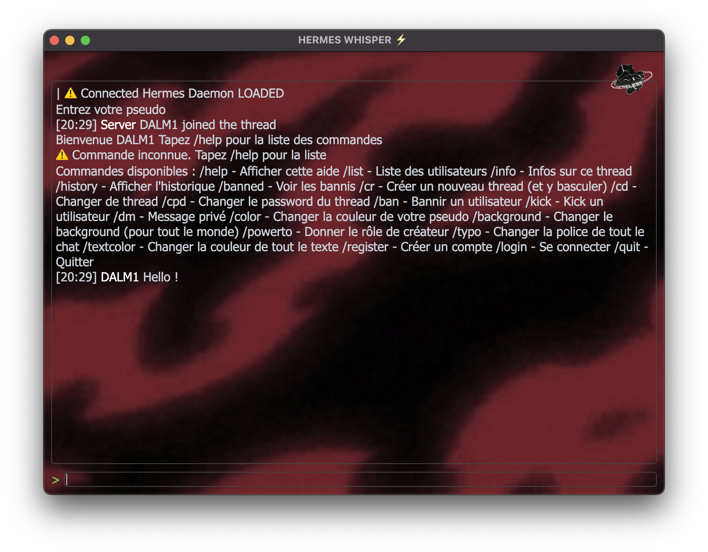

<h1 align="center">
MICRO-STORM
</h1>

 FONCTIONNALITÉS PRINCIPALES

- Gestion des Salons (Threads)
  • Création d'un nouveau thread via /cr <nom> <pass>, où le créateur devient automatiquement le propriétaire.
  • Changement de thread avec /cd <nom> <pass>, avec une transition automatique vers le nouveau thread.
  • Commande /info : affiche le nom du thread, le créateur et la liste des utilisateurs présents.
  • Commande /list : liste les utilisateurs connectés dans le thread.

- Commandes de Communication
  • /help : affiche la liste des commandes disponibles.
  • /history : affiche l'historique des messages avec des timestamps au format HH:MM.
  • /dm <pseudo> <message> : envoi d'un message privé à un utilisateur.
  • /quit : quitte le thread.

- Commandes de Personnalisation
  • /color <couleur> : change la couleur du pseudo de l'utilisateur.
  • /background <url> : change le fond pour tous les utilisateurs.
  • /typo  : change la police globale du chat.
  • /textcolor <couleur> : change la couleur globale du texte de l'application.

- Gestion des Rôles
  • Le créateur d'un thread peut bannir, expulser ou transférer le rôle via /ban, /kick et /powerto <pseudo>.

- Commandes d'Authentification
  • /register <email> <password> <pseudo> : crée un compte utilisateur en base.
  • /login <email> <password> : permet à un utilisateur de se connecter et de mettre à jour son pseudo dans le chat.

- Historique
  • Chaque thread conserve un historique en mémoire accessible via /history.

--------------------------------------------------
